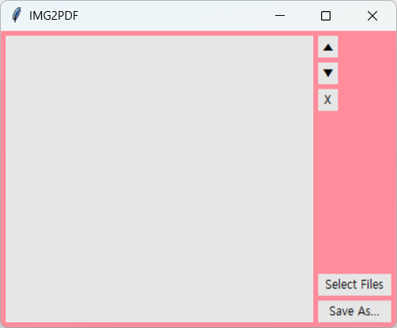
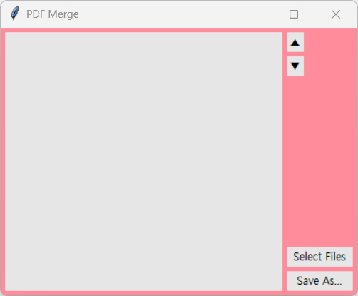
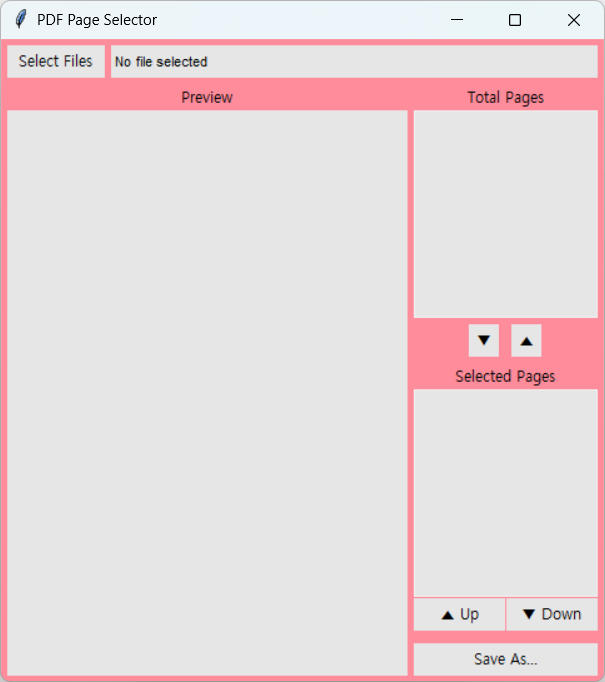

# PDF_Tools: GUI for PDF applications

### img_to_pdf.py
Convert multiple images(jpg, png) into a single PDF file.

You can set the page order.

### pdf_merge.py
Merge multiple PDF files into one.

You can set the page order.

### pdf_page_select.py
Extract selected pages into a new PDF file.

You can set the page order.

